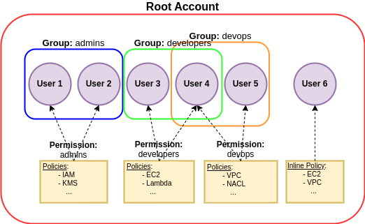
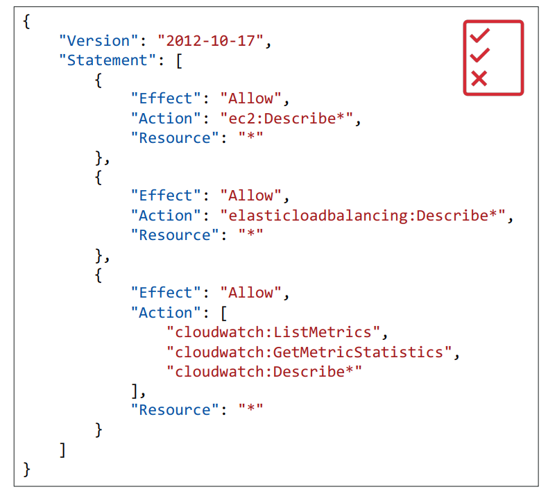
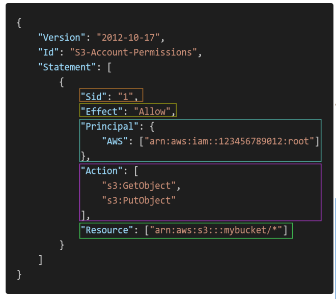
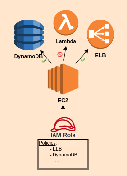

# IAM (Identity and Access Management) & AWS CLI

## 1) IAM:

- **Root account** created by default, shouldn’t be used or shared;  
- **Users** are people within your organization, and can be grouped.
Users don’t have to belong to a group, and user can belong to multiple groups;  
- **Groups** only contain users, not other groups;  
- **Permissions:** users or Groups can be assigned JSON documents called policies.
These policies define the permissions of the users;

## 2) IAM Policies Structure:
**Policies:** JSON document that outlines permissions for users or groups

## 3) Ways to access AWS:
1) **AWS Management Console** (protected by password + MFA).  
2) **AWS Command Line Interface (CLI)**: protected by access keys; A tool that 
enables you to interact with AWS services using commands in your command-line shell.  
3) **AWS Software Developer Kit (SDK)** - for code: protected by access keys. 
Language-specific APIs (set of libraries).  

## 4) IAM Roles for Services:

## 5) IAM Security Tools:
- **IAM Credentials Report (account-level)** a report that lists all your account's
users and the status of their various credentials;
- **IAM Access Advisor (user-level):** access advisor shows the service permissions 
granted to a user and when those services were last accessed. You can use this 
information to revise your policies.  
