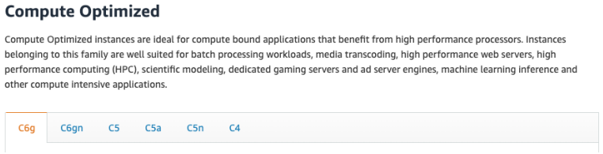
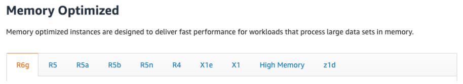
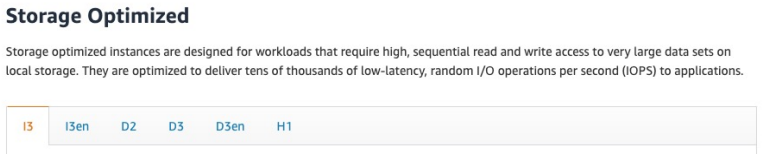
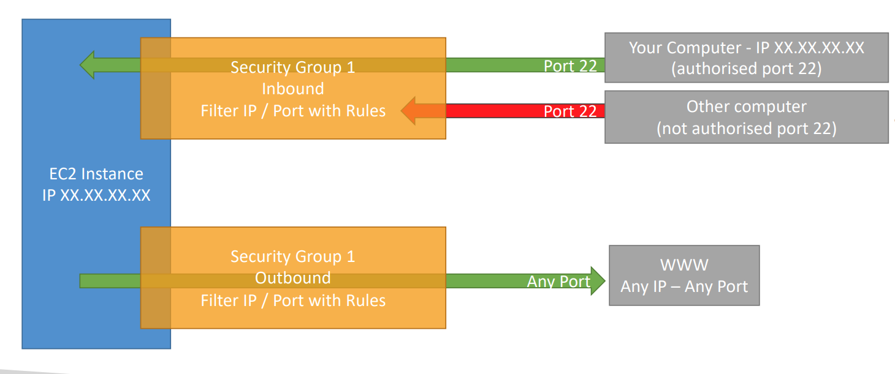
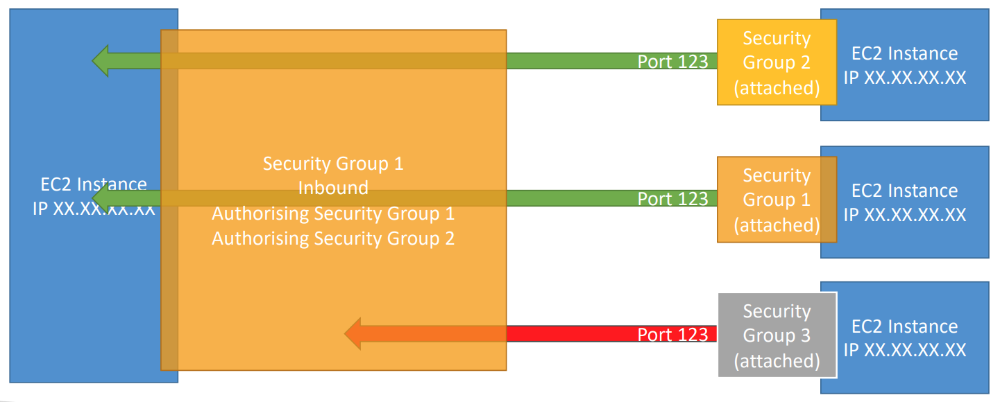
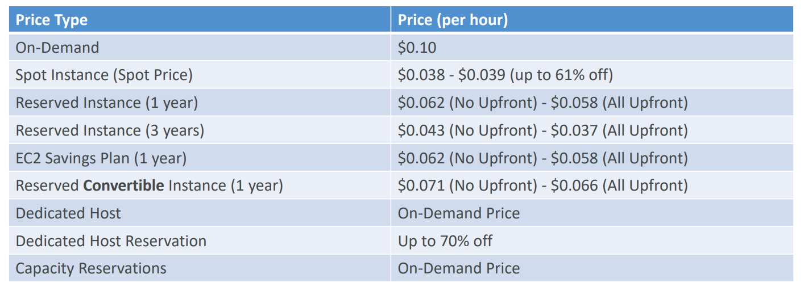

# EC2 Fundamentals

## 1) Configuration options:
  - **Operating System (OS):** Linux, Windows or Mac OS; 
  - **CPU** 
  - **RAM** 
  - **How much storage space:**
    - Network-attached (EBS & EFS); 
    - hardware (EC2 Instance Store);
  - **Network card:** speed of the card, Public IP address; 
  - **Firewall rules:** security group; 
  - **Bootstrap script (configure at first launch):** EC2 User Data. That script
is only run once at the instance first start. Is used to automate boot tasks such
as: (installing updates, installing software, downloading common files from the 
internet);

## 2) EC2 Instance Types:
1) **Compute Optimized (CPU):**  
    Batch processing workloads, Media transcoding, High performance web servers
    High performance computing (HPC), Scientific modeling & machine learning,
    Dedicated gaming servers.  
    

2) **Memory Optimized (RAM):**    
    High performance, relational/non-relational databases, Distributed web scale 
    cache stores, In-memory databases optimized for BI (business intelligence),
    Applications performing real-time processing of big unstructured data.
    

3) **Storage Optimized:**   
    High frequency online transaction processing (OLTP) systems, Relational & NoSQL
    databases, Cache for in-memory databases (for example, Redis), Data warehousing 
    applications, Distributed file systems.
    

## 3) Security Groups:
Security groups are acting as a “firewall” on EC2 instances.
  - **Control of inbound network (from other to the instance)**
  - **Control of outbound network (from the instance to other)**

Can be attached to multiple instances. Locked down to a region / VPC combination.

**Errors:**  
   - **Time out**: then it’s a security group issue;
   - **Connection refused** error, then it’s an application
     error or it’s not launched;

### Classic Ports and IP Range (CIDR):
- **22** = SSH (Secure Shell) - log into a Linux instance;
- **21** = FTP (File Transfer Protocol) – upload files into a file share;
- **22** = SFTP (Secure File Transfer Protocol) – upload files using SSH;
- **80** = HTTP – access unsecured websites;
- **443** = HTTPS – access secured websites;
- **3389** = RDP (Remote Desktop Protocol) – log into a Windows instance;

### Connect EC2 instances between each other (Authorizing Security Groups):  

## 4) EC2 Instances Purchasing Options:  
- **On-Demand Instances** – short workload, predictable pricing, pay by second.
Recommended for short-term and un-interrupted workloads, where you can't predict 
how the application will behave.
- **Reserved Instances (1 & 3 years)** – long workloads. Recommended for steady-state 
usage applications (think database).
- **Convertible Reserved Instances** – same as **Reserved Instances (1 & 3 years)** long
workloads with flexible instances. Can change the EC2 instance type, instance family, 
OS, scope and tenancy.
- **Savings Plans (1 & 3 years)** – commitment to an amount of usage, long workload
- **Spot Instances** – short workloads, cheap, can lose instances (less reliable).
Useful for workloads that are resilient to failure. Not suitable for critical jobs 
or databases.
- **Dedicated Hosts** – book an entire physical server, control instance placement.
Useful for software that have complicated licensing model (BYOL – Bring Your Own 
License).
- **Dedicated Instances** – no other customers will share your hardware
- **Capacity Reservations** – reserve capacity in a specific AZ for any duration. 
Suitable for short-term, uninterrupted workloads that needs to be in a specific AZ.

