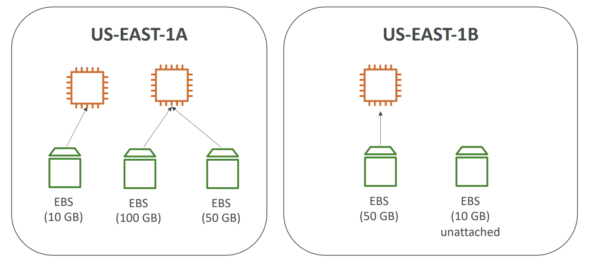
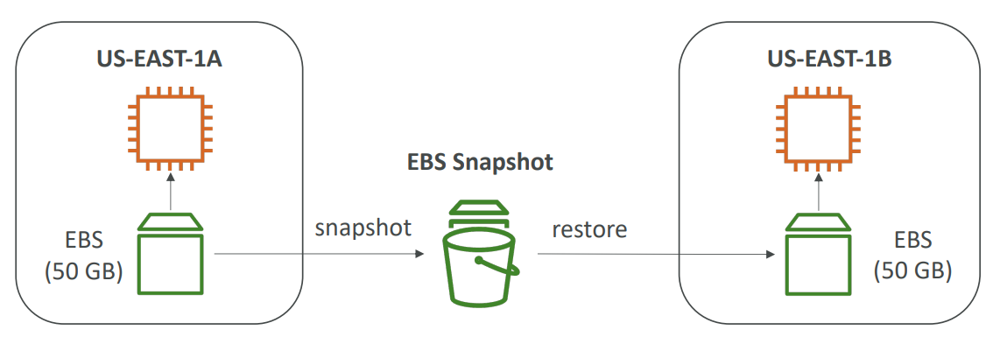
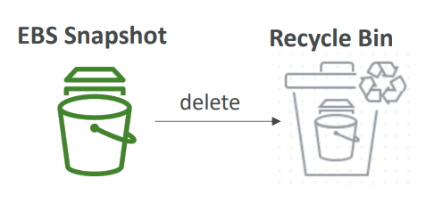
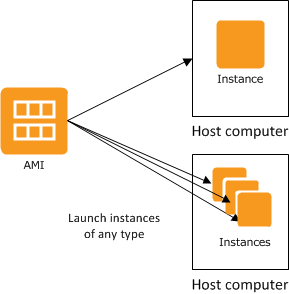
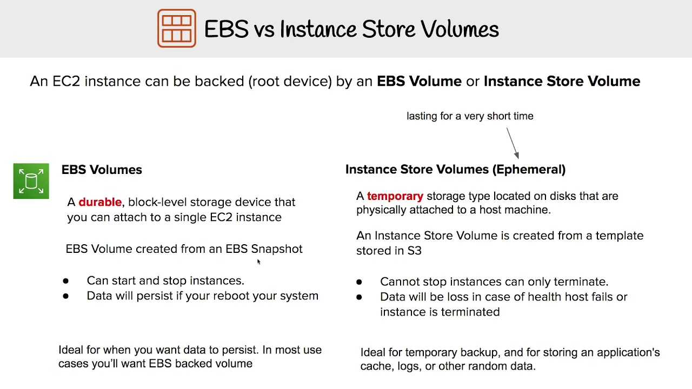
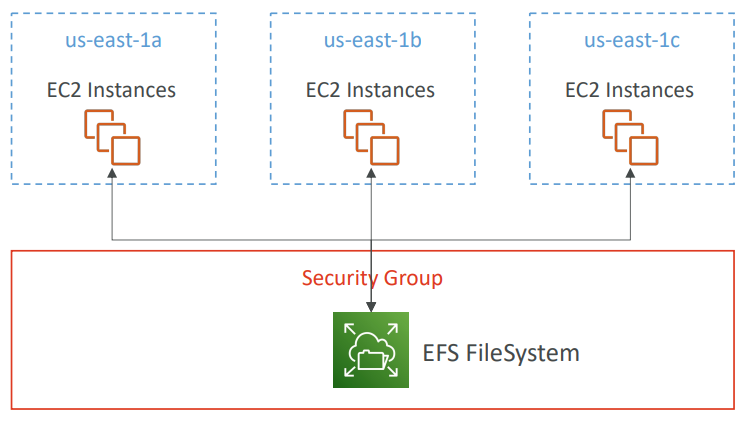

# EC2 Instance Storage (EBS Volume, Local Instance Store, AMI, EFS)

## 1) EBS Volume:
### EBS (Elastic Block Store) Volume
is a network drive you can attach to your instances while they run. It allows your 
instances to persist data, even after their termination. They can only be mounted
to one instance at a time. They are bound to a specific availability zone.

**Used for:** deploy and scale your choice of databases, including SAP HANA, Oracle,
Microsoft SQL Server, PostgreSQL, MySQL, Cassandra, and MongoDB.
Easily resize clusters for big data analytics engines, such as Hadoop and Spark, 
and freely detach and reattach volumes. Migrate mid-range, on-premises storage area 
network (SAN) workloads to the cloud.

Delete on Termination attribute controls the EBS behaviour when an EC2 instance 
terminates.

### EBS Snapshots
Make a backup (snapshot) of your EBS volume at a point in time. Not necessary to
detach volume to do snapshot, but recommended. Can copy snapshots across AZ or Region.

**Features:**  
  - **EBS Snapshot Archive:** move a Snapshot to an 'archive tier' that is 75% cheaper.
  - **Recycle Bin for EBS Snapshots:** setup rules to retain deleted snapshots so you
    can recover them after an accidental deletion.  
    
  - **Fast Snapshot Restore (FSR):** force full initialization of snapshot to have no
  latency on the first use.

### EBS Volumes come in 6 types:
  - **ngp2 / gp3 (SSD):** General purpose SSD volume that balances price and performance
    for a wide variety of workloads. Great for: System boot volumes, Virtual desktops, 
    Development and test environment.
  - **io1 / io2 (SSD):** Highest-performance SSD volume for mission-critical low-latency
    or high-throughput workloads. Great for databases workloads (sensitive to storage 
    perf and consistency).  
    **Supports EBS Multi-attach:** attach the same EBS volume to multiple EC2
    instances in the same AZ. Great for achieve higher application availability in 
    clustered Linux applications (ex: Teradata). Applications must manage concurrent
    write operations.

  - **st1 (HDD):** Low cost HDD volume designed for frequently accessed, 
    throughput-intensive workloads. For data that is infrequently accessed.
  - **sc1 (HDD):** Lowest cost HDD volume designed for less frequently accessed workloads.
    For data that is infrequently accessed.

## 2) AMI (Amazon Machine Imag):
**AMI** are a customization of an EC2 instance. You add your own software, configuration,
operating system, monitoring… Faster boot / configuration time because all your 
software is pre-packaged.  
Built for a specific region (and can be copied across regions). You can launch EC2 
instances from: a Public AMI, your own AMI, an AWS Marketplace AMI.

## 3) EC2 Local Instance Store:

**Compare to EBS:**
EBS volumes are network drives with good but “limited” performance. If you need a
high-performance hardware disk, use EC2 Instance Store. Better I/O performance.
EC2 Instance Store lose their storage if they’re stopped (ephemeral).
Good for buffer / cache / scratch data / temporary content. Risk of data loss if
hardware fails. Backups and Replication are your responsibility.

## 3) EFS:
Managed NFS (network file system) that can be mounted on many EC2. EFS works with EC2 
instances in multi-AZ. Highly available, scalable, expensive (3x gp2), pay per use.
Uses NFSv4.1 protocol. Uses security group to control access to EFS.  

**Use cases:** content management, web serving, data sharing, Wordpress;

## CONCLUSION:

