# Scalability & High Availability

### Kinds of scalability:
  - **Vertical Scalability** (increasing the size
    of the instance);  
    **Tools:**  
      - From: t2.nano - 0.5G of RAM, 1 vCPU  
        To: u-12tb1.metal – 12.3 TB of RAM, 448 vCPU
  - **Horizontal Scalability** (increasing the
    number of instances / systems for your
    application);  
    **Tools:**  
      - Auto Scaling Group;
      - Load Balancer;
      - Lambdas;
  - **High Availability** (running your
    application / system in at least 2 data
    centers (== Availability Zones));  
    **Tools:**
      - Auto Scaling Group multi AZ;
      - Load Balancer multi AZ
    
## 1) Load balancers (Elastic Load Balancer):
### Usage:
  - Spread load across multiple downstream instances; 
  - Expose a single point of access (DNS) to your application; 
  - Seamlessly handle failures of downstream instances; 
  - Do regular health checks to your instances; 
  - Provide SSL termination (HTTPS) for your websites; 
  - Enforce stickiness with cookies; 
  - High availability across zones; 
  - Separate public traffic from private traffic;

### Attach ELB to EC2:
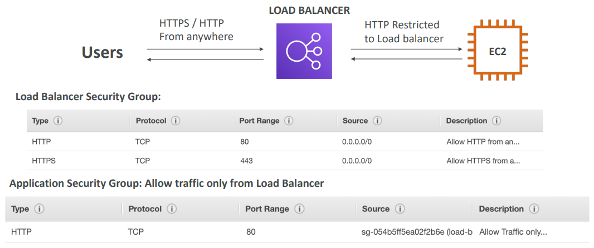

### Types:
### 1) Classic Load Balancer (Layer 7, Layer 4):
- **Supporting PROTOCOLS:** HTTP, HTTPS, TCP, SSL (secure TCP);  
- **Health checks:** are TCP or HTTP based;
- **Fixed hostname;**
- **Support Cross-Zone Load Balancing:** Disabled by default. No charges for inter AZ data if enabled;
- **Support only one SSL;**
- **Supports Connection Draining;**

### 2) Application Load Balancer (Layer 7):
- **Supporting PROTOCOLS:** HTTP, HTTPS, WebSocket;
- **Routing tables to different target groups:**
  - Routing based on path in URL (example.com/users & example.com/posts);
  - Routing based on hostname in URL (one.example.com & other.example.com);
  - Routing based on Query String, Headers (example.com/users?id=123&order=false);
- **Health checks:** all;
- **Fixed hostname;**
- **Support Sticky Sessions;**
- **Support Cross-Zone Load Balancing:** Enabled by default. No charges for inter AZ data;
- **Support SNI;**
- **Support multiple listeners with multiple SSL;**
- **Supports Connection Draining (Deregistration Delay);**

### Target Groups:
- **EC2 instances** (can be managed by an Auto Scaling Group) – HTTP;
- **Routing tables to different target groups;**
- **ECS tasks** (managed by ECS itself) – HTTP;
- **Lambda functions** – HTTP request is translated into a JSON event;
- **IP Addresses** – must be private IPs;

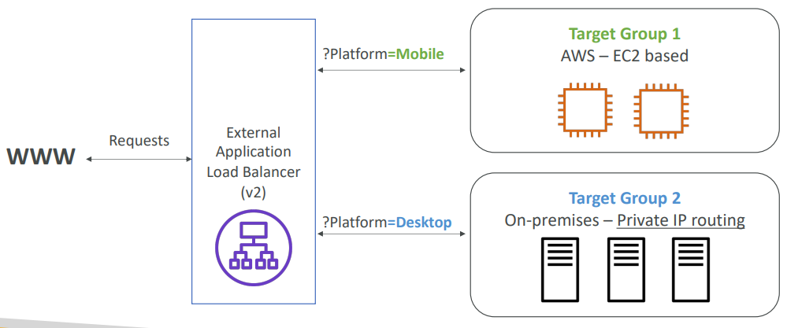

### 3) Network Load Balancer (Layer 4):
- **Supporting PROTOCOLS:** TCP, TLS (secure TCP), UDP;
- **Handle millions of request per seconds;**
- **Has one static IP per AZ, and supports assigning Elastic IP;**
- **Health checks:** all;
- **Support Cross-Zone Load Balancing:** disabled by default. You pay charges ($) for inter AZ data
if enabled;
- **Support SNI;**
- **Support multiple listeners with multiple SSL;**
- **Supports Connection Draining (Deregistration Delay);**

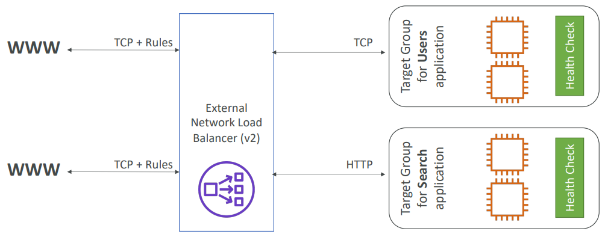

### Target Groups:
- **EC2 instances;**
- **IP Addresses** – must be private IPs;
- **Application Load Balancer;**

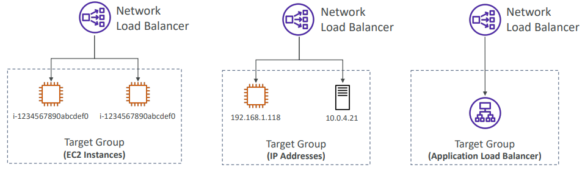

### 4) Gateway Load Balancer (Layer 3):
- **Supporting PROTOCOLS:** Operates at layer 3 (Network layer)/GENEVE – IP Protocol;
- Deploy, scale, and manage a fleet of **3rd party network virtual appliances** in AWS
(Firewalls, Intrusion Detection and Prevention Systems, Deep Packet Inspection Systems, 
payload manipulation)

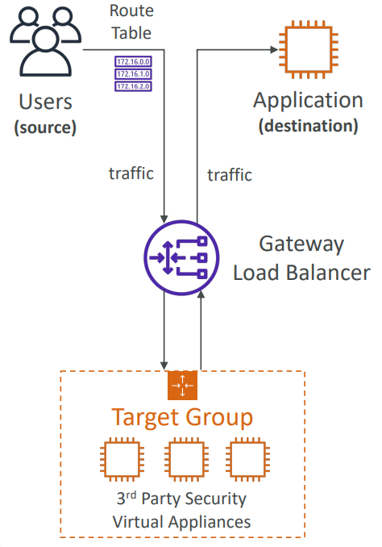

### Target Groups:
- **EC2 instances**
- **IP Addresses** – must be private IPs

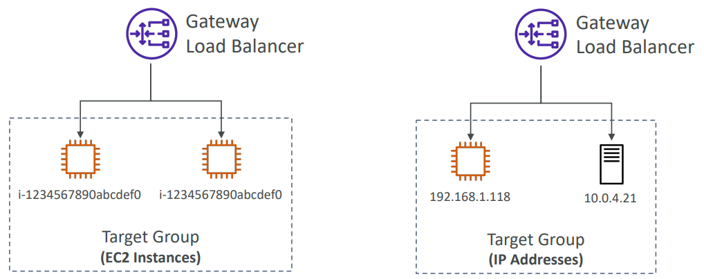

## 2) ELB TOOLS:
### 1) Sticky Sessions (Session Affinity):
It is possible to implement stickiness so that the same client is always redirected to
the same instance behind a load balancer. The “cookie” used for stickiness has an expiration
date you control; Use case: make sure the user doesn’t lose his
session data; Enabling stickiness may bring imbalance to the load over the backend EC2
instances;

**Types:**
- **Application-based Cookies:**
    - <ins>Custom cookie:</ins> generated by the target. Can include any custom attributes
      required by the application. Cookie name must be specified individually for each target group.
    - <ins>Application cookie:</ins> Generated by the load balancer. Cookie name is AWSALBAPP.
- **Duration-based Cookies:** Cookie generated by the load balancer. Cookie name is AWSALB
  for ALB, AWSELB for CLB.

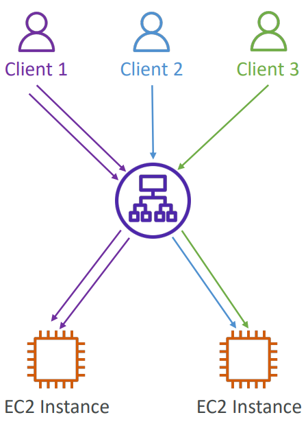

### 2) Cross-Zone Load Balancing:
Each load balancer instance distributes evenly across all registered instances in all AZ.

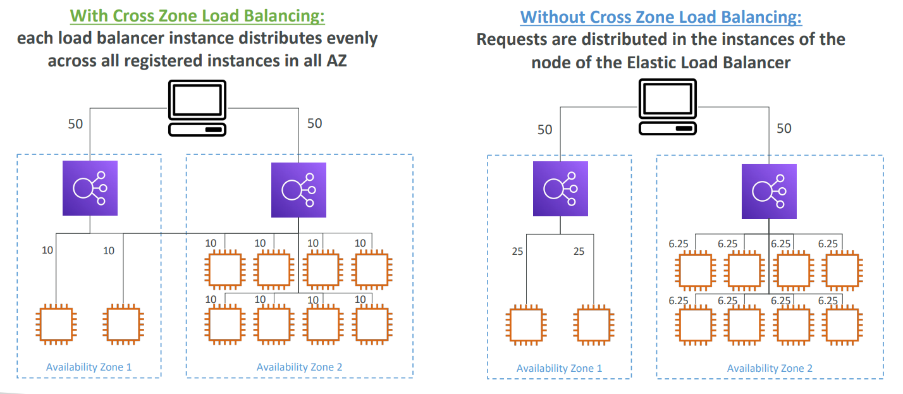

### 3) SSL/TLS:
- **SSL** refers to Secure Sockets Layer, used to encrypt connections
- **TLS** refers to Transport Layer Security, which is a newer version

### 3.1) Server Name Indication (SNI)
-  SNI solves the problem of loading multiple SSL certificates onto one web server
(to serve multiple websites);
- It’s a “newer” protocol, and requires the client to indicate the hostname of the 
target server in the initial SSL handshake;
- The server will then find the correct certificate, or return the default one;

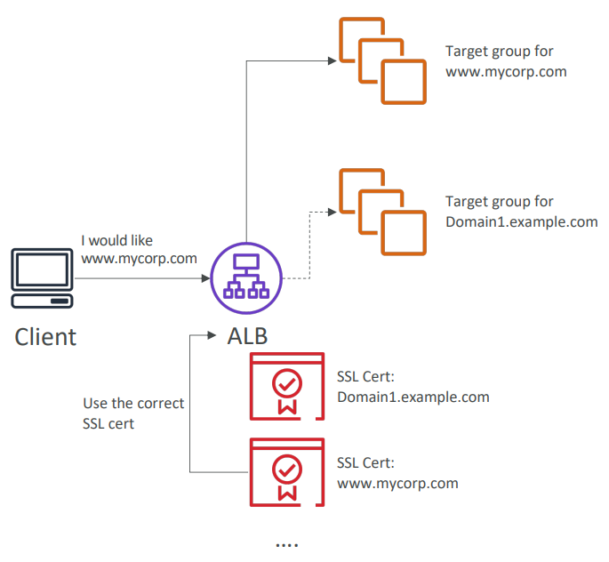

### 4) Connection Draining:
Time to complete “in-flight requests” while the instance is de-registering or unhealthy.
Stops sending new requests to the EC2 instance which is de-registering.

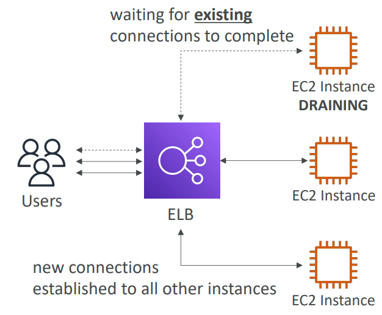

## 3) ELB Conclusion:
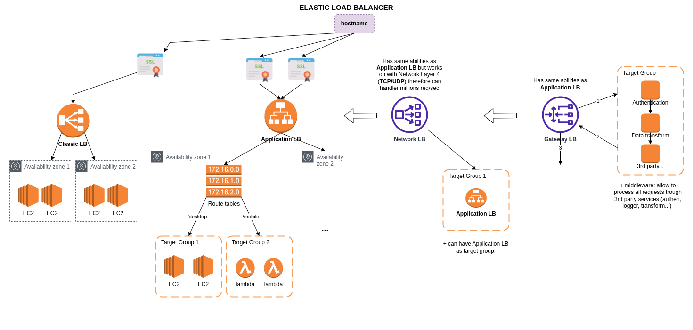

## 4) Auto Scaling Group:
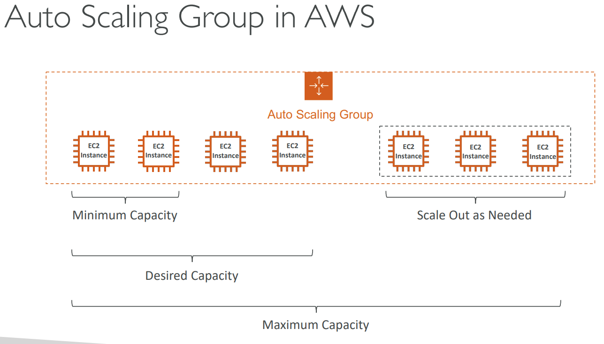

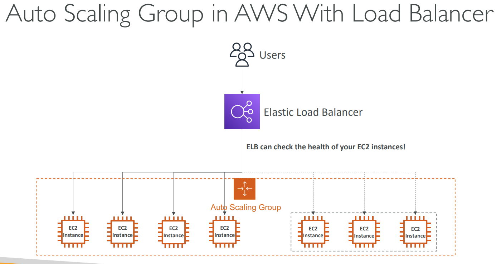

### **Auto Scaling Group Attributes:**
### - **Launch Template:**
  - AMI + Instance Type
  - EC2 User Data
  - EBS Volumes
  - Security Groups
  - SSH Key Pair
  - IAM Roles for your EC2 Instances
  - Network + Subnets Information
  - Load Balancer Information
### - **Min Size / Max Size / Initial Capacity**
### - **Scaling Policies:**  
It is possible to scale an ASG based on CloudWatch alarms. An alarm monitors a metric (such 
as CPUUtilization, RequestCountPerTarget, Average Network In / Out, Any custom metric).  
**Based on the alarm:**  
  - We can create scale-out policies (increase the number of instances)
  - We can create scale-in policies (decrease the number of instances)
  
  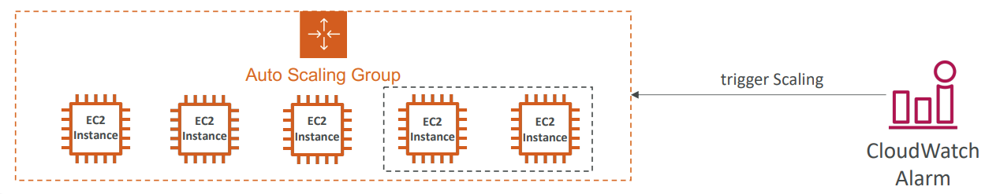

**Dynamic Scaling Policies:**
- **Target Tracking Scaling:**  
Most simple and easy to set-up. Example: I want the average ASG CPU to stay at around 40.
- **Simple / Step Scaling:**  
When a CloudWatch alarm is triggered (example CPU > 70%), then add 2 units. When a CloudWatch
alarm is triggered (example CPU < 30%), then remove.
- **Scheduled Actions:**  
Anticipate a scaling based on known usage patterns. Example: increase the min capacity to 10 
at 5 pm on Fridays.
- **Predictive scaling:**  
Continuously forecast load and schedule scaling ahead.
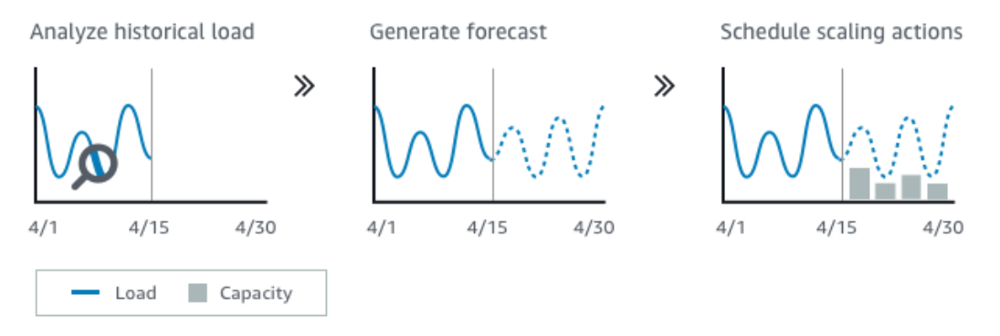

### - **Scaling Cooldowns:**
After a scaling activity happens, you are in the cooldown period (default 300 seconds).
During the cooldown period, the ASG will not launch or terminate additional
instances (to allow for metrics to stabilize). Advice: Use a ready-to-use AMI to reduce
configuration time in order to be serving request faster and reduce the cooldown period.

### - **Instance Refresh:**
**Goal:** update launch template and then re-creating all EC2 instances.
For this we can use the native feature of Instance Refresh. Setting of minimum 
healthy percentage. Specify warm-up time (how long until the instance is ready to use).
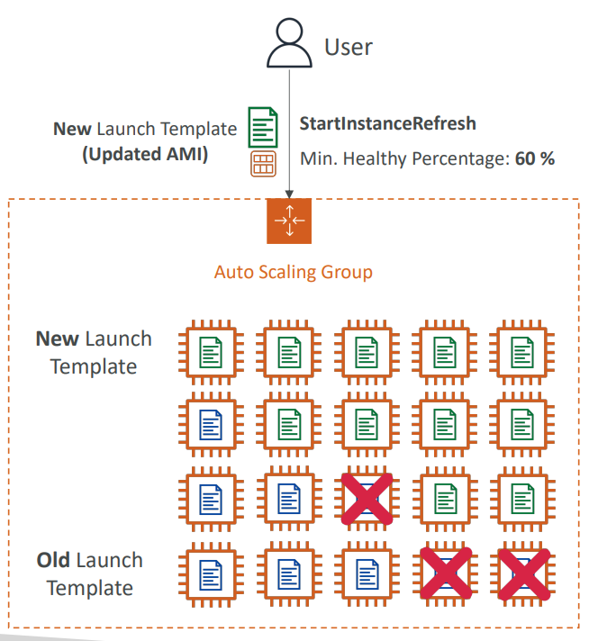
