# RDS & Aurora & Caching

## 1) RDS:
Is a collection of managed services that makes it simple to set up, operate, and 
scale databases in the cloud.  
**It allows you to create databases in the cloud that are managed by AWS:**
- Postgres;
- MySQL;
- MariaDB;
- Oracle;
- Microsoft SQL Server;
- Aurora (AWS Proprietary database);

**Abilities:**  
- Automated provisioning, OS patching;
- Continuous backups and restore to specific timestamp (Point in Time Restore)!;
- Monitoring dashboards;
- Read replicas for improved read performance;
- Multi AZ setup for DR (Disaster Recovery);
- Maintenance windows for upgrades;
- Scaling capability (vertical and horizontal);
- Storage backed by EBS (gp2 or io1);

### Scaling:
1) **<ins>Storage Auto Scaling:</ins>**  
   When RDS detects you are running out of free database storage, it scales automatically.
   You have to set Maximum Storage Threshold (maximum limit for DB storage).  

   **Automatically modify storage if:**   
     - Free storage is less than 10% of allocated storage; 
     - Low-storage lasts at least 5 minutes; 
     - 6 hours have passed since last modification;
   
   Supports all RDS database engines (MariaDB, MySQL, PostgreSQL, SQL Server, Oracle).
   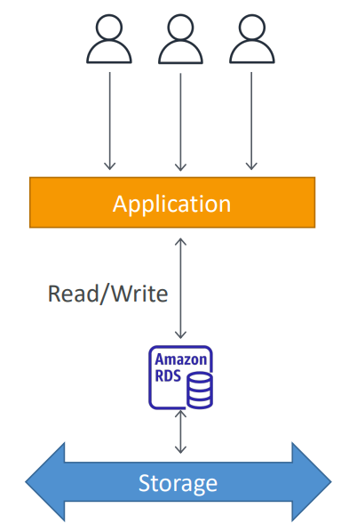

2) **<ins>Read scalability (Read Replicas):</ins>**  
   Up to 5 Read Replicas. Within AZ, Cross AZ or Cross Region.
   Replication is ASYNC, so reads are eventually consistent.
   Replicas can be promoted to their own DB.
   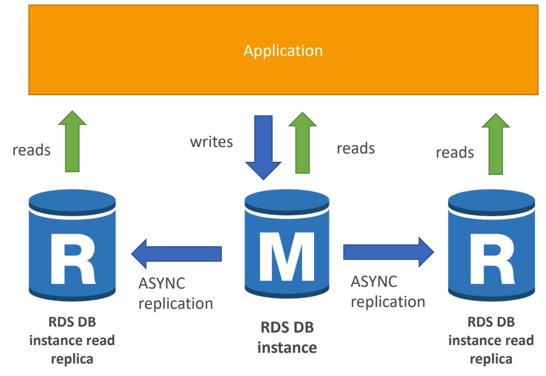
   **Costs:**  
   For RDS Read Replicas within the same region, you don’t pay that fee.
   In AWS there’s a network cost when data goes from one AZ to another.
   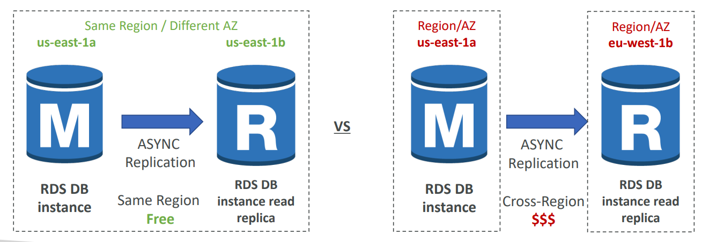

### Disaster Recovery:
1) **<ins>SYNC replication:</ins>**  
   One DNS name – automatic app failover to standby. Increase availability.
   Failover in case of loss of AZ, loss of network, instance or storage failure.  
   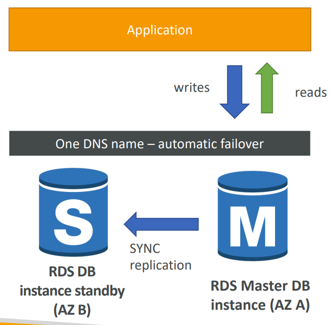

### Multi-AZ:
1) **<ins>From Single-AZ to Multi-AZ:</ins>**  
   Zero downtime operation (no need to stop the DB). Just click on “modify” for the
   database.  
   **The following happens internally:**  
      1) A snapshot is taken;
      2) A new DB is restored from the snapshot in a new AZ;
      3) Synchronization is established between the two databases;
   
   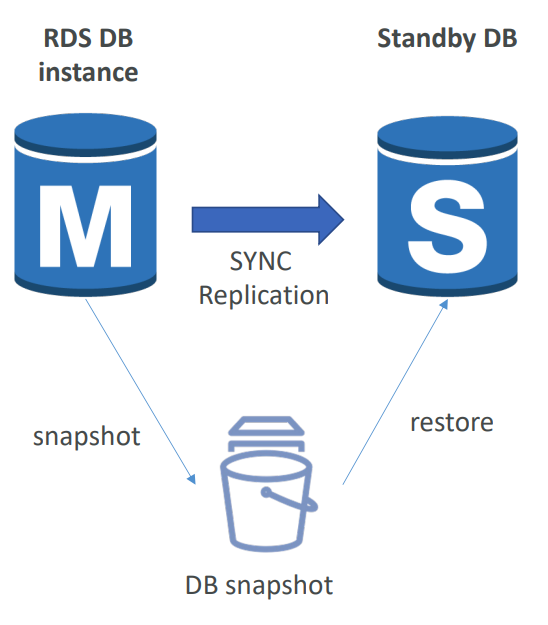

## 2) Aurora:
Aurora is a proprietary technology from AWS (not open sourced).
Postgres and MySQL are both supported as Aurora DB (that means your 
drivers will work as if Aurora was a Postgres or MySQL database).  

**Pros:**  
  - **AWS cloud optimized:** claims 5x performance improvement
    over MySQL on RDS, over 3x the performance of Postgres on RDS.
  - **Automatically storage scaling:** grows in increments of 10GB, up to 128 TB. 
  - **Write/Read Scaling:** can have 15 replicas while MySQL has 5, and the replication 
    process is faster (sub 10 ms replica lag).

Aurora costs more than RDS (20% more).

### Scaling:
1) **<ins>Storage Auto Scaling:</ins>**  
   Automatically storage scaling grows in increments of 10GB, up to 128 TB.

2) **<ins>Read scalability (Read Replicas):</ins>**  
   Master + up to 15 Aurora Read Replicas serve reads.  
   **6 copies of your data across 3 AZ:** 
     - 4 copies out of 6 needed for writes;
     - 3 copies out of 6 need for reads;
     - Self healing with peer-to-peer replication;
     - Storage is striped across 100s of volumes;
   
   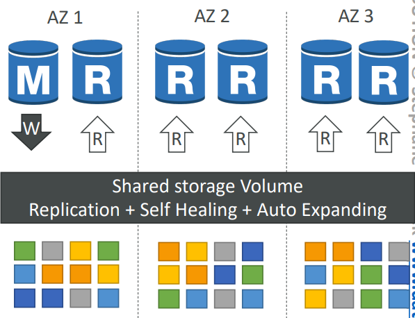
     
4) **<ins>Support for Cross Region Replication</ins>** 

### Disaster Recovery:
Automatic fail-over.

## 3) RDS & Aurora Security:

### 1)  **<ins>Data Encryption:</ins>**
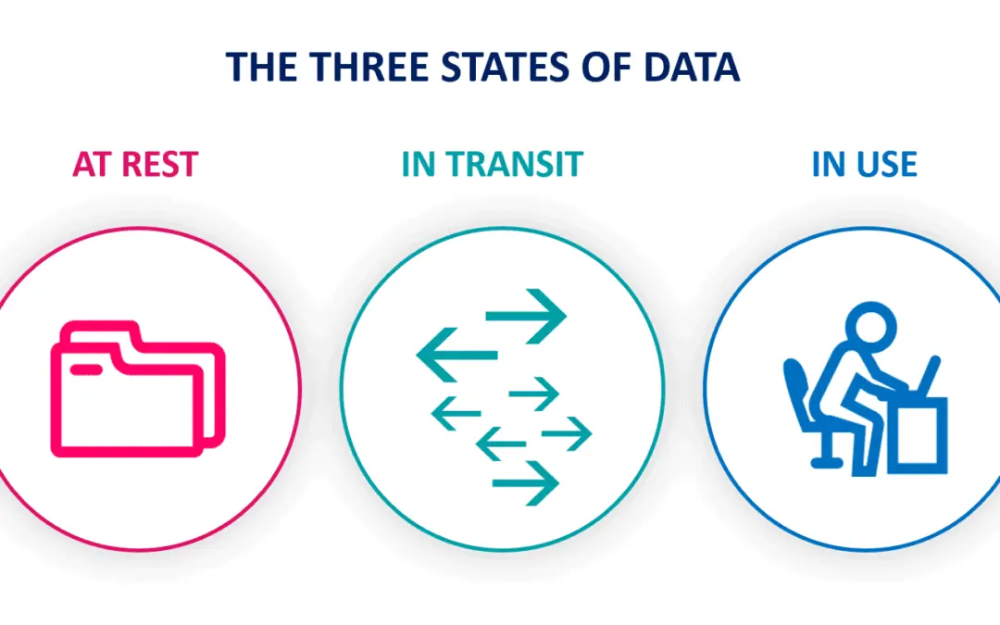

1) **<ins>At-rest encryption:</ins>**  
    - Database master & replicas encryption using AWS KMS – must be defined as launch time;
    - If the master is not encrypted, the read replicas cannot be encrypted;
    - To encrypt an un-encrypted database, go through a DB snapshot & restore as encrypted;

2) **<ins>In-transit encryption:</ins>**  
    TLS-ready by default, use the AWS TLS root certificates client-side.

### 2)  **<ins>Authentication (IAM):</ins>**
IAM roles to connect to your database (instead of username/pw).

### 3)  **<ins>Network security (Security Groups):</ins>**
Through **Security Groups** control Network access to your RDS / Aurora DB

## 4) RDS Proxy:
**Target:** optimize connections to DB.  
Fully managed database proxy for RDS. Allows apps to pool and share DB connections
established with the database.
Improving database efficiency by reducing the stress on database resources (e.g., CPU,
RAM) and minimize open connections (and timeouts). Reduced RDS & Aurora failover time
by up 66%. Enforce IAM Authentication for DB, and securely store credentials in AWS Secrets
Manager. RDS Proxy is never publicly accessible (must be accessed from VPC).

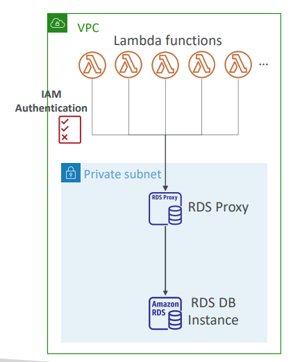

## 5) ElasticCache:
ElasticCache is to get managed Redis or Memcached. AWS takes care of OS maintenance / patching,
optimizations, setup, configuration, monitoring, failure recovery and backups.

### Use cases:
1) **<ins>DB Cache:</ins>**  
Applications queries ElastiCache, if not available, get from RDS and store in ElasticCache.  
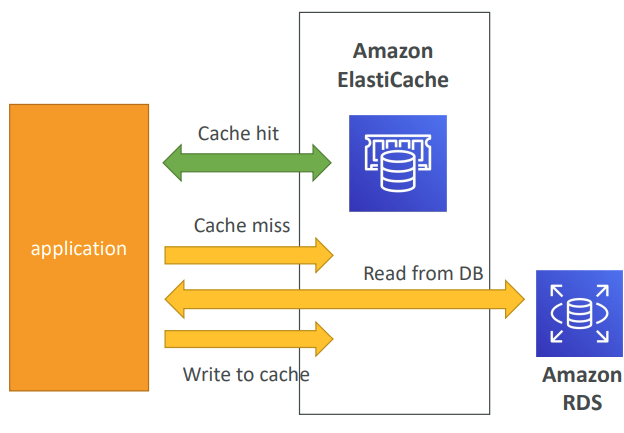

2) **<ins>User Session Store:</ins>**  
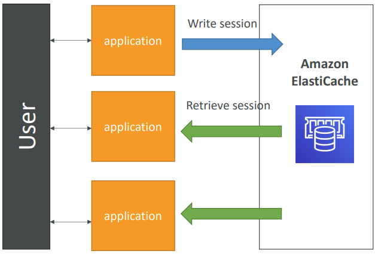

### Strategies:
1) **<ins>Lazy Loading / Cache aside:</ins>**  
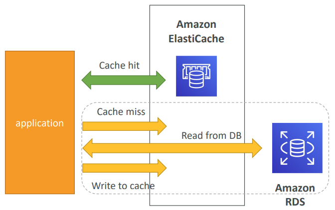

2) **<ins>Write Through:</ins>**  
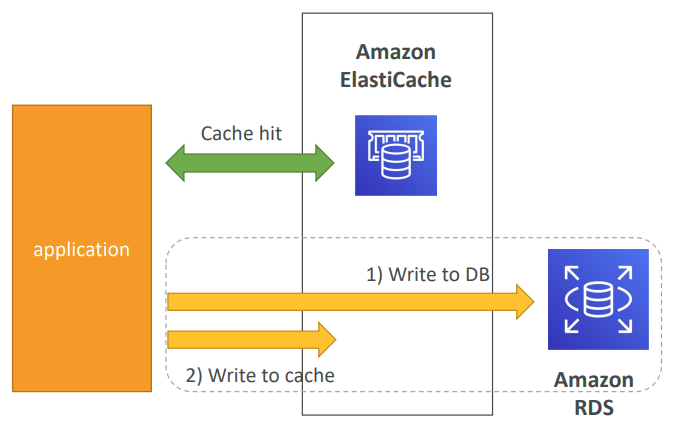

**Cache Evictions:**  
Cache eviction can occur in three ways:  
  - You delete the item explicitly in the cache
  - Item is evicted because the memory is full and it’s not recently used (LRU)
  - You set an item time-to-live (or TTL) can range from few seconds to hours or days.
