# Route 53

## 1) DNS:
**Domain Name System** which translates the human friendly hostnames
into the machine IP addresses (www.google.com => 172.217.18.36).

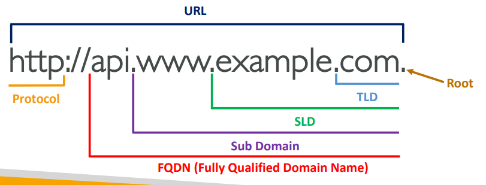

## 2) Route 53:
A highly available, scalable, fully managed and Authoritative DNS.

### Record:
Each record contains:  
- **Domain/subdomain Name** – e.g., example.com
- **Record Type** – e.g., (A / AAAA / CNAME / NS...)
- **Value** – IP address of routing resource (EC2, ELB, S3, CloudFront...) 12.34.56.78
- **Routing Policy** – how Route 53 responds to queries
- **TTL** – amount of time the record cached at DNS Resolvers

### Record Types:
- **A** – maps a hostname to IPv4
- **AAAA** – maps a hostname to IPv6
- **CNAME** (ONLY FOR NON ROOT DOMAIN, not amazon resource host name) – maps a hostname to another hostname. The target is a domain 
name which must have an A or AAAA record (app.mydomain.com => blabla.anything.com). 
You can’t create for example.com, but you can create for www.example.com.
- **NS** – Name Servers for the Hosted Zone. Control how traffic is routed for a domain.
- **Alias** (for ROOT DOMAIN (ELB, Cloud Front) and NON ROOT DOMAIN) - Points a hostname to an AWS Resource
(app.mydomain.com => blabla.amazonaws.com). Free of charge. Native health check.
Automatically recognizes changes in the resource’s IP addresses.
Unlike CNAME, it can be used for the top node of a DNS namespace (Zone Apex), e.g.:
example.com. You can’t set the TTL.  
**Alias Records Targets:**
  - Elastic Load Balancers
  - CloudFront Distributions
  - API Gateway
  - Elastic Beanstalk environments
  - S3 Websites
  - VPC Interface Endpoints
  - Global Accelerator accelerator
  - Route 53 record in the same hosted zone

### Hosted Zones ($0.50 per month):
A container for records that define how to route traffic to a domain and
its subdomains.
- **Public Hosted Zones** – contains records that specify how to route
traffic on the Internet (public domain names).
- **Private Hosted Zones** – contain records that specify how you route
traffic within one or more VPCs (private domain names).

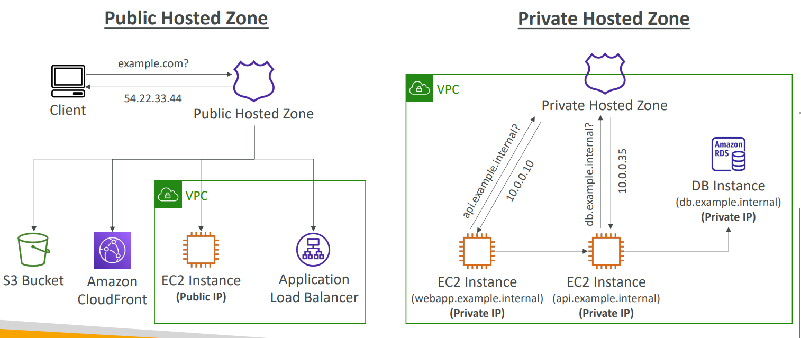

### TTL (Time To Live)
Except for Alias records, TTL is mandatory for each DNS record.
- **High TTL** – e.g., 24 hr: Less traffic on Route 53. Possibly outdated records.
- **Low TTL** – e.g., 60 sec: More traffic on Route 53 ($$). Records are outdated for less
time. Easy to change records

### Routing Policies:
Define how Route 53 responds to DNS queries.  

**Policies:**
- **<ins>Simple:</ins>**  
  Typically, route traffic to a single resource. Can specify multiple values in the
  same record. If multiple values are returned, a random one is chosen by the client.
  When Alias enabled, specify only one AWS resource. Can’t be associated with Health
  Checks.  
  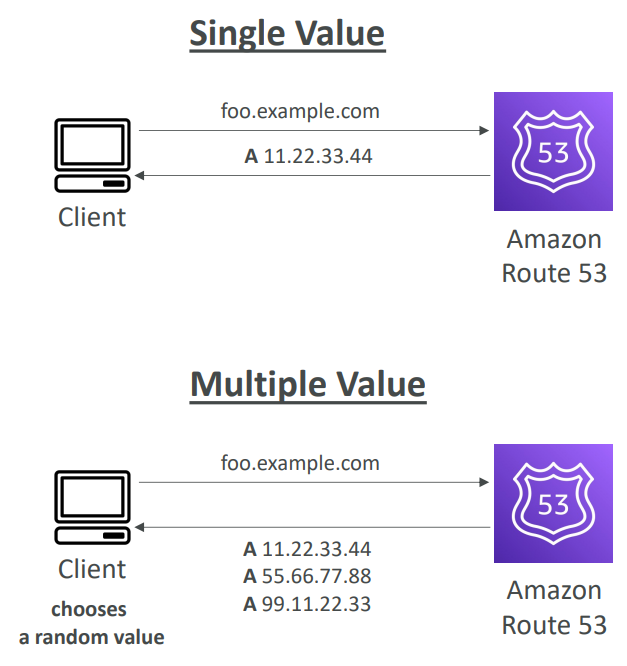

- **<ins>Weighted:</ins>**  
  Control the % of the requests that go to each specific resource. 
  DNS records must have the same name and type. Can be associated with Health Checks.    
  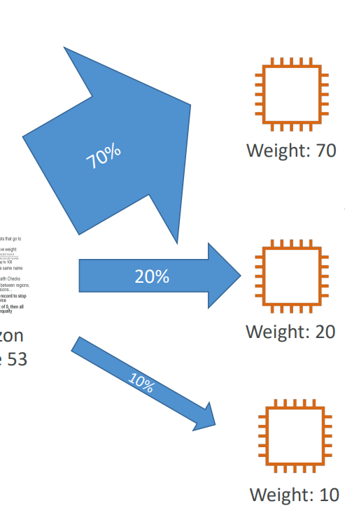

- **<ins>Failover:</ins>**   
  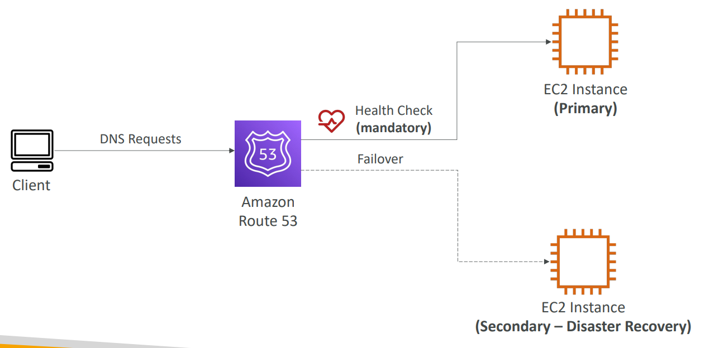
- **<ins>Latency based:</ins>**  
  Redirect to the resource that has the least latency close to us.
  Super helpful when latency for users is a priority.
  Latency is based on traffic between users and AWS Regions.  
  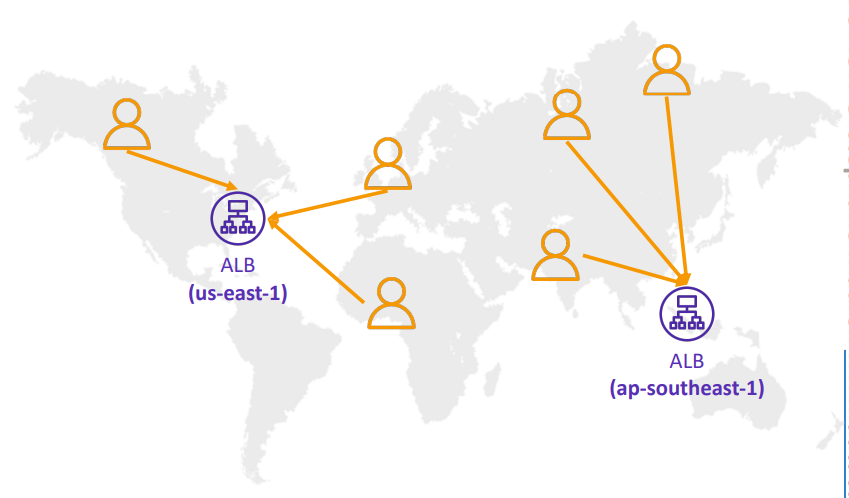

- **<ins>Geolocation:</ins>**
  Different from Latency-based! This routing is based on user location.
  Specify location by Continent, Country or by US State (if there’s overlapping,
  most precise location selected). Should create a “Default” record (in
  case there’s no match on location). Can be associated with Health Checks.  
  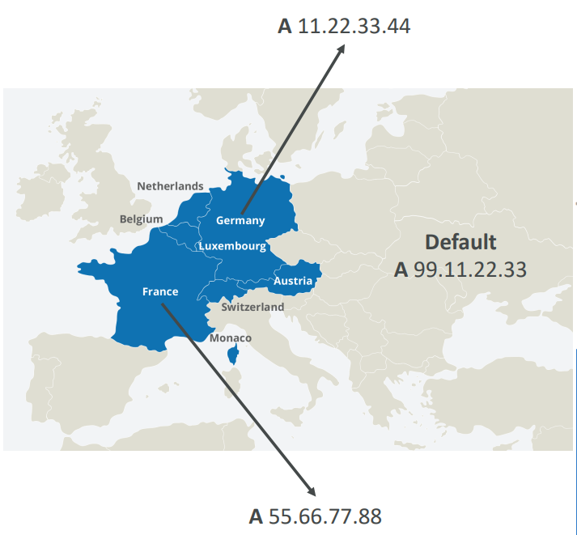

- **<ins>Multi-Value Answer:</ins>**
  Use when routing traffic to multiple resources. Route 53 return multiple values/resources.
  Can be associated with Health Checks (return only values for healthy resources).
  Up to 8 healthy records are returned for each Multi-Value query.
  Multi-Value is not a substitute for having an ELB.  
  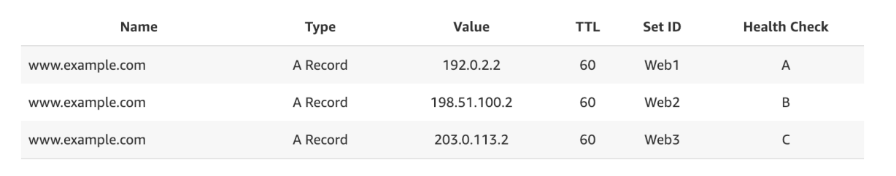

- **<ins>Geoproximity:</ins>** (using Route 53 Traffic Flow feature)
  Route traffic to your resources based on the geographic location of users and
  resources. Ability to shift more traffic to resources based on the defined bias.
  To change the size of the geographic region, specify bias values:
    - To expand (1 to 99) – more traffic to the resource
    - To shrink (-1 to -99) – less traffic to the resource
  
  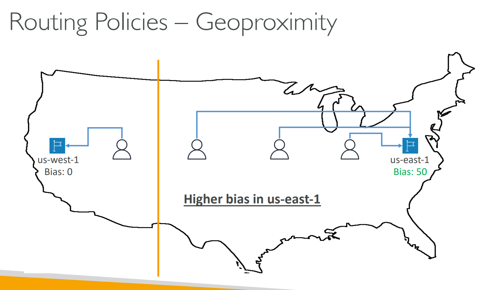
    
### Health Checks
HTTP Health Checks are only for public resources.  
**Health Check => Automated DNS Failover:**  
1. Health checks that monitor an endpoint (application, server, other AWS resource).
2. Health checks that monitor other health checks (Calculated Health Checks).
3. Health checks that monitor CloudWatch Alarms (full control !!) – e.g., throttles of
   DynamoDB, alarms on RDS, custom metrics, … (helpful for private resources).

**Strategies:**
- **Monitor an Endpoint:**  
  About 15 global health checkers will check the endpoint health. Health Checks pass
  only when the endpoint responds with the 2xx and 3xx status codes.
  Health Checks can be setup to pass / fail based on the text in the first 5120 bytes
  of the response. Configure you router/firewall to allow incoming
  requests from Route 53 Health Checkers.  
  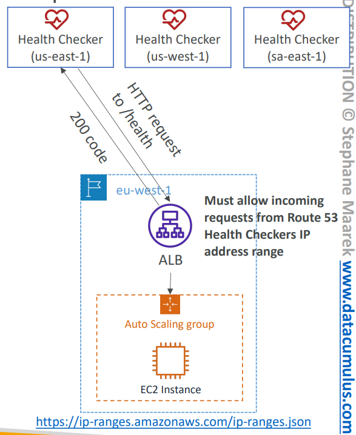

- **Calculated Health Checks:**  
  Combine the results of multiple Health Checks into a single Health Check.
  You can use OR, AND, or NOT. Can monitor up to 256 Child Health Checks.
  Specify how many of the health checks need to pass to make the parent pass.  
  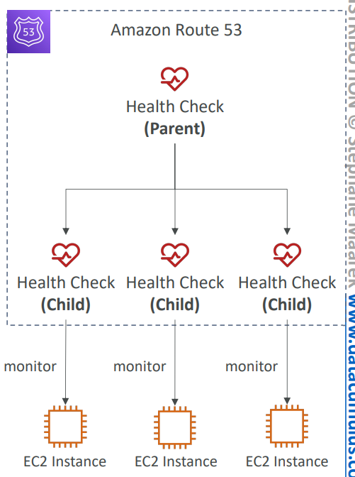

- **Monitor an Endpoint:**  
  Route 53 health checkers are outside the VPC. They can’t access private endpoints
  (private VPC or on-premises resource). You can create a CloudWatch Metric and
  associate a CloudWatch Alarm, then create a Health Check that checks the
  alarm itself.  
  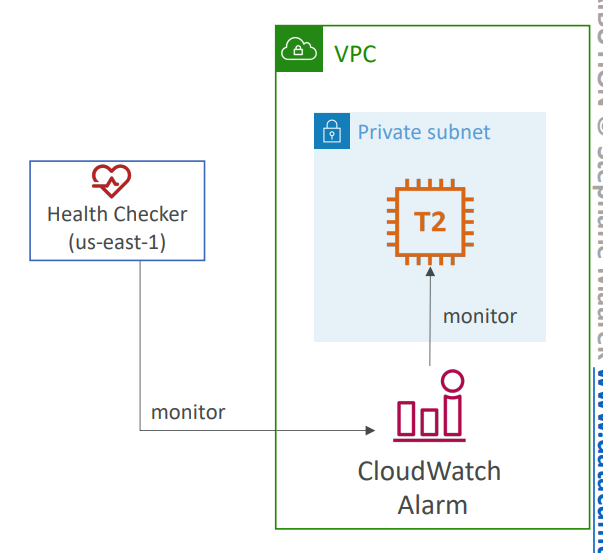
