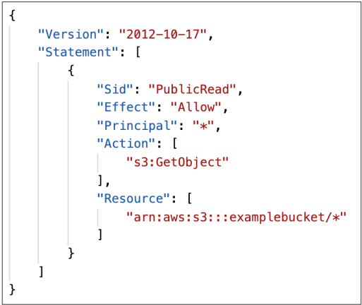
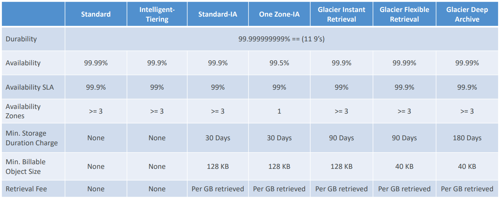
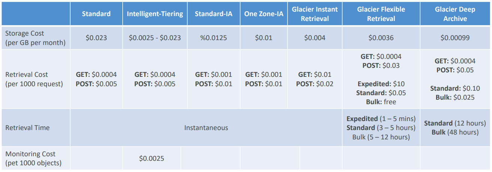

# S3 
Storage

## 1) Buckets:
Amazon S3 allows people to store objects (files) in “buckets” (directories).
Buckets must have a globally unique name (across all regions all accounts.
Buckets are defined at the region level.

## 2) Objects:
Objects (files) have a Key. The key is composed of prefix + object name
(s3://my-bucket/my_folder1/another_folder/my_file.txt).  
- **Max. Object Size** is 5TB (5000GB). If uploading more than 5GB, must use “multi-part upload”.
- **Metadata** (list of text key / value pairs – system or user metadata)
- **Tags** (Unicode key / value pair – up to 10) – useful for security / lifecycle
- **Version ID** (if versioning is enabled)

## 3) Security:
- **User-Based:**
  - **IAM Policies** – which API calls should be allowed for a specific user from IAM.
- **Resource-Based:**
  - **Bucket Policies** – bucket wide rules from the S3 console - allows cross account
  - **Object Access Control List (ACL)** – finer grain (can be disabled)
  - **Bucket Access Control List (ACL)** – less common (can be disabled)
- **Encryption:** encrypt objects in Amazon S3 using encryption keys
- **Bucket settings for Block Public Access**

### Bucket Policies:
**<ins>JSON based policies:</ins>**   
- **Resources:** buckets and objects;
- **Effect:** Allow / Deny; 
- **Actions:** Set of API to Allow or Deny; 
- **Principal:** The account or user to apply the policy to;

**<ins>Usage:</ins>**  
- Grant public access to the bucket. 
- Force objects to be encrypted at upload.
- Grant access to another account (Cross Account).

## 4) Versioning:
You can version your files in Amazon S3. Same key overwrite will change the “version”: 1, 2, 3….  
It is best practice to version your buckets:  
- Protect against unintended deletes (ability to restore a version)
- Easy roll back to previous version

## 5) Replication (CRR & SRR):
Must enable Versioning in source and destination buckets.
Cross-Region Replication (CRR). Same-Region Replication (SRR).
Must give proper IAM permissions to S3.
After you enable Replication, only new objects are replicated.
Optionally, you can replicate existing objects using S3 Batch Replication.
Replicates existing objects and objects that failed replication.
**For DELETE operations:**  
- Can replicate delete markers from source to target (optional setting)
- Deletions with a version ID are not replicated (to avoid malicious deletes)

## 6) Storage Classes:
- **Amazon S3 Standard:**   
  99.99% Availability. Used for frequently accessed data. Low latency and high 
  throughput. Sustain 2 concurrent facility failures.
- **Amazon S3 Standard-Infrequent Access (IA)**  
  For data that is less frequently accessed, but requires rapid access when needed.
  Lower cost than S3 Standard. 99.9% Availability.
- **Amazon S3 One Zone-Infrequent Access**  
  For data that is less frequently accessed, but requires rapid access when needed.
  Lower cost than S3 Standard. High durability (99.999999999%) in a single AZ; data 
  lost when AZ is destroyed. 99.5% Availability.
- **Amazon S3 Glacier Instant Retrieval**
  Low-cost object storage meant for archiving / backup. Pricing: price for storage + 
  object retrieval cost. Millisecond retrieval, great for data accessed once a quarter
  Minimum storage duration of 90 days.
- **Amazon S3 Glacier Flexible Retrieval**
  Low-cost object storage meant for archiving / backup. Pricing: price for storage +
  object retrieval cost. Expedited (1 to 5 minutes), Standard (3 to 5 hours), Bulk 
  (5 to 12 hours) – free. Minimum storage duration of 90 days.
- **Amazon S3 Glacier Deep Archive**
  Low-cost object storage meant for archiving / backup. Pricing: price for storage +
  object retrieval cost. Standard (12 hours), Bulk (48 hours). Minimum storage duration
  of 180 days
- **Amazon S3 Intelligent Tiering**
  Small monthly monitoring and auto-tiering fee. Moves objects automatically between 
  Access Tiers based on usage.
  - Frequent Access tier (automatic): default tier
  - Infrequent Access tier (automatic): objects not accessed for 30 days
  - Archive Instant Access tier (automatic): objects not accessed for 90 days
  - Archive Access tier (optional): configurable from 90 days to 700+ days
  - Deep Archive Access tier (optional): config. from 180 days to 700+ days

